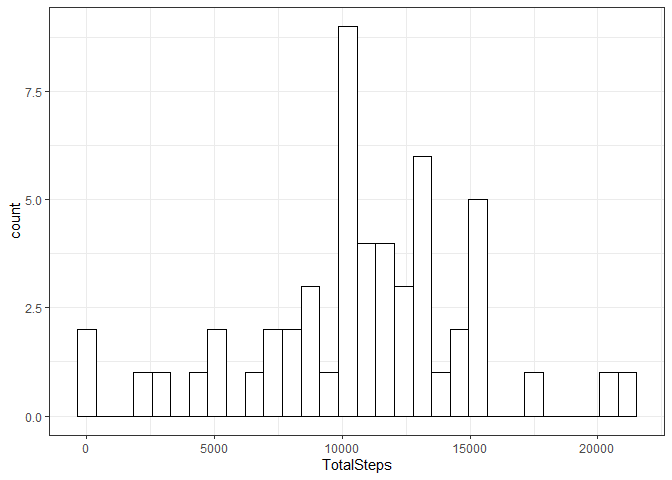
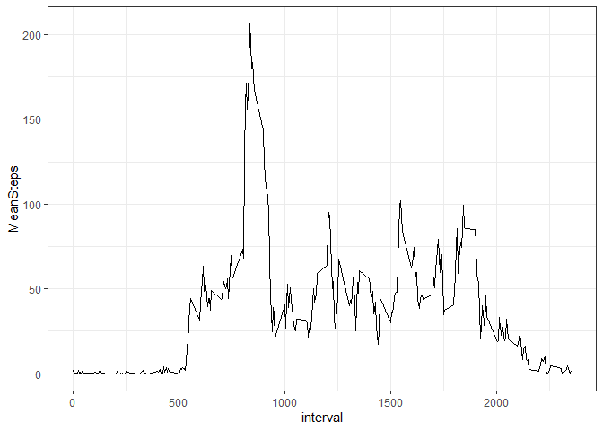
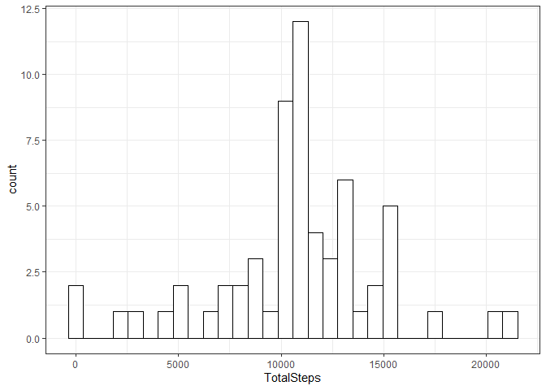
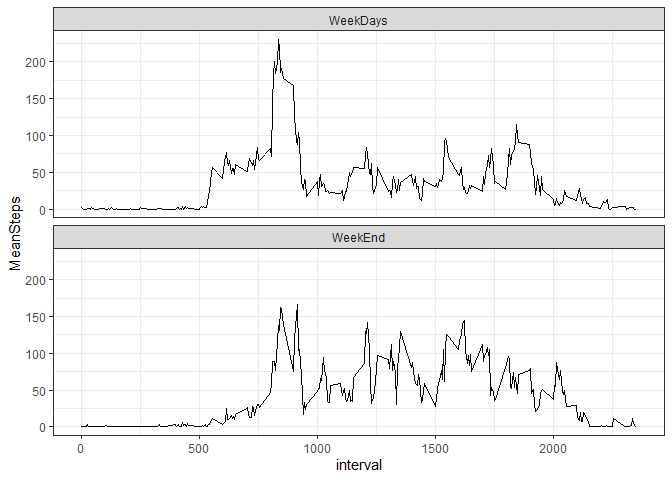

## Accessing and tidy the data
1. clear the workspace and load necessary library
2. Unzip and read the data, storing it in dataframe df 
3. store df properly formatted in df.row which can be used for reference in the assignment for row data


```
## 
## Attaching package: 'dplyr'
```

```
## The following objects are masked from 'package:stats':
## 
##     filter, lag
```

```
## The following objects are masked from 'package:base':
## 
##     intersect, setdiff, setequal, union
```

```
## <!-- html table generated in R 4.0.3 by xtable 1.8-4 package -->
## <!-- Fri Feb 26 19:30:49 2021 -->
## <table border=1>
## <tr> <th>  </th> <th> steps </th> <th> date </th> <th> interval </th>  </tr>
##   <tr> <td align="right"> 1 </td> <td align="right">  </td> <td align="right"> 15614.00 </td> <td align="right">   0 </td> </tr>
##   <tr> <td align="right"> 2 </td> <td align="right">  </td> <td align="right"> 15614.00 </td> <td align="right">   5 </td> </tr>
##   <tr> <td align="right"> 3 </td> <td align="right">  </td> <td align="right"> 15614.00 </td> <td align="right">  10 </td> </tr>
##   <tr> <td align="right"> 4 </td> <td align="right">  </td> <td align="right"> 15614.00 </td> <td align="right">  15 </td> </tr>
##   <tr> <td align="right"> 5 </td> <td align="right">  </td> <td align="right"> 15614.00 </td> <td align="right">  20 </td> </tr>
##   <tr> <td align="right"> 6 </td> <td align="right">  </td> <td align="right"> 15614.00 </td> <td align="right">  25 </td> </tr>
##    </table>
```

```
## <!-- html table generated in R 4.0.3 by xtable 1.8-4 package -->
## <!-- Fri Feb 26 19:30:49 2021 -->
## <table border=1>
## <tr> <th>  </th> <th>     steps </th> <th>      date </th> <th>    interval </th>  </tr>
##   <tr> <td align="right"> X </td> <td> Min.   :  0.00   </td> <td> Min.   :2012-10-01   </td> <td> Min.   :   0.0   </td> </tr>
##   <tr> <td align="right"> X.1 </td> <td> 1st Qu.:  0.00   </td> <td> 1st Qu.:2012-10-16   </td> <td> 1st Qu.: 588.8   </td> </tr>
##   <tr> <td align="right"> X.2 </td> <td> Median :  0.00   </td> <td> Median :2012-10-31   </td> <td> Median :1177.5   </td> </tr>
##   <tr> <td align="right"> X.3 </td> <td> Mean   : 37.38   </td> <td> Mean   :2012-10-31   </td> <td> Mean   :1177.5   </td> </tr>
##   <tr> <td align="right"> X.4 </td> <td> 3rd Qu.: 12.00   </td> <td> 3rd Qu.:2012-11-15   </td> <td> 3rd Qu.:1766.2   </td> </tr>
##   <tr> <td align="right"> X.5 </td> <td> Max.   :806.00   </td> <td> Max.   :2012-11-30   </td> <td> Max.   :2355.0   </td> </tr>
##   <tr> <td align="right"> X.6 </td> <td> NA's   :2304   </td> <td>  </td> <td>  </td> </tr>
##    </table>
```

## Steps per day: Mean median and histogram 
This chunk will: 
1. Process data by removing the na values and doing the sum the number of steps per day, storing it in df.StepsDay
2. Make a histogram of the total number of steps taken each day
3. Provide a summary including the mean and median of the total number of steps per day for the dataframe using html and knitr


```r
df.StepsDay = df.row %>% filter(!is.na(steps)) %>% group_by(date) %>% 
  summarize(TotalSteps=sum(steps,na.rm=T)) 

ggplot(df.StepsDay,aes(TotalSteps))+
  geom_histogram(bins = 30, color="black", fill="white")+
  theme_bw()
```

<!-- -->

```r
xts <- xtable(summary(df.StepsDay))
print(xts,type="html")
```

```
## <!-- html table generated in R 4.0.3 by xtable 1.8-4 package -->
## <!-- Fri Feb 26 19:30:50 2021 -->
## <table border=1>
## <tr> <th>  </th> <th>      date </th> <th>   TotalSteps </th>  </tr>
##   <tr> <td align="right"> X </td> <td> Min.   :2012-10-02   </td> <td> Min.   :   41   </td> </tr>
##   <tr> <td align="right"> X.1 </td> <td> 1st Qu.:2012-10-16   </td> <td> 1st Qu.: 8841   </td> </tr>
##   <tr> <td align="right"> X.2 </td> <td> Median :2012-10-29   </td> <td> Median :10765   </td> </tr>
##   <tr> <td align="right"> X.3 </td> <td> Mean   :2012-10-30   </td> <td> Mean   :10766   </td> </tr>
##   <tr> <td align="right"> X.4 </td> <td> 3rd Qu.:2012-11-16   </td> <td> 3rd Qu.:13294   </td> </tr>
##   <tr> <td align="right"> X.5 </td> <td> Max.   :2012-11-29   </td> <td> Max.   :21194   </td> </tr>
##    </table>
```

```r
knitr::kable(summarise(df.StepsDay,Mean=mean(TotalSteps),Median=median(TotalSteps)),align="c",caption="Mean and Median for steps per day")
```


Table: Mean and Median for steps per day

|   Mean   | Median |
|:--------:|:------:|
| 10766.19 | 10765  |
## Average daily activity pattern
Daily pattern chunk will :
1. Process data by removing the na values and taking average steps by interval across all days (datafarme: df.AverageInterval)
2. Plot the time series 
3. Provide the maximum average steps in one interval and the interval 5mn it occurs


```r
df.AverageInterval = df.row %>% filter(!is.na(steps)) %>% group_by(interval) %>%
  summarize(MeanSteps=mean(steps,na.rm=T)) 
MaxAvgIntI <- which.max(df.AverageInterval$MeanSteps)
MaxAvgInt <- df.AverageInterval$interval[MaxAvgIntI]
MaxAvgSteps <- max(df.AverageInterval$MeanSteps)

ggplot(df.AverageInterval,aes(interval, y= MeanSteps))+
  geom_path(color = "black")+
  theme_bw()
```

<!-- -->

```r
knitr::kables(
  list(
    knitr::kable(MaxAvgInt, col.name = ("Interval time for maximum average steps"),valign="t"),
    knitr::kable(MaxAvgSteps, col.name = ("Maximum Steps"),valign="t")
  ),
   caption="Maximum and corresponding interval"
)
```


<table class="kable_wrapper">
<caption>Maximum and corresponding interval</caption>
<tbody>
  <tr>
   <td> 

| Interval time for maximum average steps|
|---------------------------------------:|
|                                     835|

 </td>
   <td> 

| Maximum Steps|
|-------------:|
|      206.1698|

 </td>
  </tr>
</tbody>
</table>

## Filling the blanks
1. Identify in NA rows and store them in data frame: df.missing
2. Reporting number of NA row and total of row for the dataset 
3. Use the average step per interval to estimate values and replace the NA (df.model)
4. Plot histogram of the steps taken each day using modellised data
5. Report Mean and Median of the modelised data and observe the difference due to the 8 days with missing data that are all now with value which are increasing the mean


```r
df.missing = df.row  %>% filter (is.na(steps)) %>% group_by(date) %>%
  summarize(TotalSteps=sum(steps,na.rm=T))

TotalRow <- length(df.row$steps)
MissingRow <- sum(is.na(df.row$steps))
PercentageMissing <- round((sum(is.na(df.row$steps)/length(df.row$steps)*100)))

knitr::kables(
  list(
    knitr::kable(MissingRow, col.name = ("Total missing rows"),valign="c"),
    knitr::kable(TotalRow, col.name = ("Total rows"),valign="c"),
    knitr::kable(PercentageMissing, col.name = ("Percentage of missing data"),valign="c")
    ),
  caption="Missing rows versus data set"
)
```


<table class="kable_wrapper">
<caption>Missing rows versus data set</caption>
<tbody>
  <tr>
   <td> 

| Total missing rows|
|------------------:|
|               2304|

 </td>
   <td> 

| Total rows|
|----------:|
|      17568|

 </td>
   <td> 

| Percentage of missing data|
|--------------------------:|
|                         13|

 </td>
  </tr>
</tbody>
</table>

```r
df.model = df.row
for (i in unique(df.model$interval)){
  value = filter(df.AverageInterval,interval==i)$MeanSteps
  df.model=mutate(df.model, steps=ifelse(interval==i & is.na(steps),value, steps))
}

df.model.StepsDay= df.model %>% group_by(date) %>%
  summarize(TotalSteps=sum(steps,na.rm=T)) 
 
ggplot(df.model.StepsDay,aes(TotalSteps))+
  geom_histogram(bins = 30, color="black", fill="white")+
  theme_bw()
```

<!-- -->

```r
knitr::kables(
  list(
    knitr::kable(summarise(df.StepsDay,Mean=mean(TotalSteps),Median=median(TotalSteps)),valign="c",caption="Ignoring NA"),
    knitr::kable(summarise(df.model.StepsDay,Mean=mean(TotalSteps),Median=median(TotalSteps)),valign="c",caption="Model for NA")
  ),
   caption="Mean and Median ignoring or modelising Missing Values"
)
```


<table class="kable_wrapper">
<caption>Mean and Median ignoring or modelising Missing Values</caption>
<tbody>
  <tr>
   <td> 

Table: Ignoring NA

|     Mean| Median|
|--------:|------:|
| 10766.19|  10765|

 </td>
   <td> 

Table: Model for NA

|     Mean|   Median|
|--------:|--------:|
| 10766.19| 10766.19|

 </td>
  </tr>
</tbody>
</table>
## Weekday and Weekend patterns
1. Process the data to add the information weekday and calculate the average steps by interval for weekday and weekend
2. Plot the time series using the simulated data and observe that usually weekday 2 peak are observed at the beginning of morning -around 8.30am - and end of afternoon -around 6pm-, likely related to transport to workplace.


```r
df.model.weekday=mutate(df.model,weekday=ifelse(weekdays(date) %in% c("Sunday","Saturday"),"WeekEnd","WeekDays"))

df.model.weekdayAverageInterval = df.model.weekday %>% group_by(weekday,interval) %>% 
  summarize(MeanSteps=mean(steps))
```

```
## `summarise()` has grouped output by 'weekday'. You can override using the `.groups` argument.
```

```r
ggplot(df.model.weekdayAverageInterval,aes(interval, y=MeanSteps))+
  facet_wrap(~weekday,nrow=2)+
  geom_path(color = "black")+
  theme_bw()
```

<!-- -->

